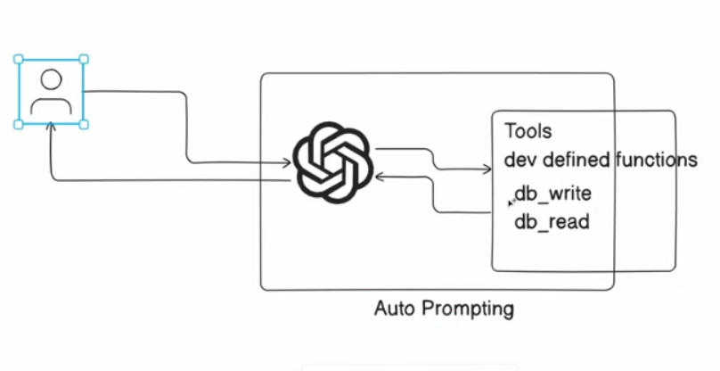

## What is an AI agent? 
An AI agent refers to a system or program that is capable of autonomously performing tasks
on behalf of a user or another system `by designing it's workflow` and `utilizing available tools`.
- `TLDR`- Agent is an LLM with access to tools

### pros of LLM
- can do NLP (natural language processing)
- can accept prompts 

### con of LLM
- cannot perform a task  

## In AI Agentic Workflows
- we take an LLM and we build some kind of framework 
